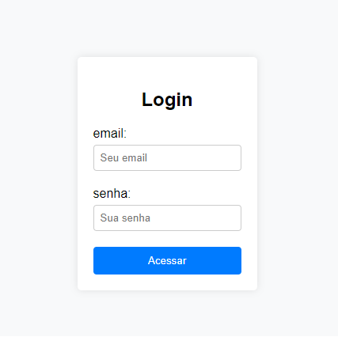

# Formulário de Login
Formulário desenvolvido em aulas, tendo o professor Leonardo como orientador.

 
## Índice
* [Descrição](#descrição)
* [Introdução](#introdução)
* [Funcionalidades](#funcionalidades)
* [tTecnologias etécnicas utilizadas](#técnicas-e-tecnologias-utilizadas)
* [Fontes Consultadas](#fontes-consultadas)
* [Autor](#autor)
 
## Descrição
O site de login é uma página simples e objetiva, com o objetivo de permitir que usuários registrados no site acessem áreas restritas. A página é composta por dois campos:
 
- **Endereço de e-mail:** O usuário deve inserir seu endereço de e-mail registrado no site.
- **Senha:** O usuário deve inserir sua senha registrada no site.
 
- Após inserir os dados, o usuário clica no botão **Entrar**. Se os dados forem válidos, o usuário é autenticado e pode acessar o conteúdo restrito.
 
## Introdução
Resumo:

Para se cadastrar, siga estes passos:

Acesse o link no "About".
Preencha os campos "E-mail" e "Senha".
(Opcional) Marque "Lembre de mim".
Clique em "Entrar".
Dicas para criar uma senha forte:

Mínimo de 8 caracteres.
Inclua maiúsculas, minúsculas, números e símbolos.
Evite senhas previsíveis, como nome, data de nascimento ou endereço.

## Funcionalidades
 - Este site de login oferece uma funcionalidade crucial ao permitir que usuários registrados acessem áreas restritas, utilizando exclusivamente a combinação de e-mail e senha. Essa abordagem de autenticação é fundamental para garantir a segurança de conteúdos sensíveis em sites, tais como fóruns, lojas virtuais e áreas administrativas. O método é simples e eficaz: o usuário insere seu e-mail e senha, os quais são verificados no banco de dados do site. Se os dados são válidos, o acesso ao conteúdo restrito é concedido.
## Tecnologias e técnicas utilizadas
* [<code></code>](https://developer.mozilla.org/pt-BR/docs/Web/HTML)
* [<code></code>](https://developer.mozilla.org/pt-BR/docs/Web/CSS)
* [<code></code>](https://git-scm.com/)
* [<code></code>](https://code.visualstudio.com/)
* [<code></code>](https://github.com/)
 
## Fontes consultadas
* [Fotos para o subtópico "Técnicas e tecnologias consultadas"](https://github.com/alexandresanlim/Badges4-README.md-Profile)
* [Bard IA](https://bard.google.com/?utm_source=sem&utm_medium=paid-media&utm_campaign=q4ptBR_sem6&gclid=Cj0KCQiAgqGrBhDtARIsAM5s0_k9W8OsK3vmqlcY5UaHv-rq88tc1i5vpDnRCh9RXFkoF3otpUqYCr4aAgjyEALw_wcB)
 
## Autor
Antony Barbosa
